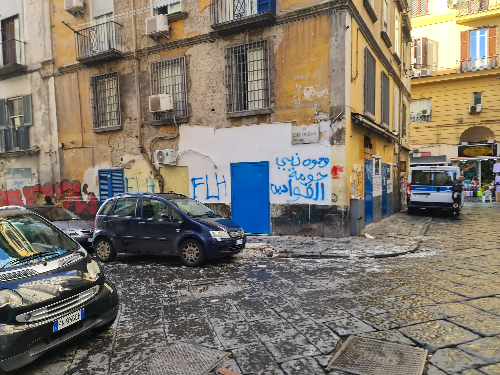
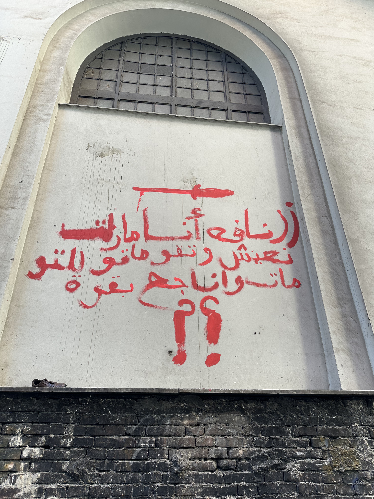
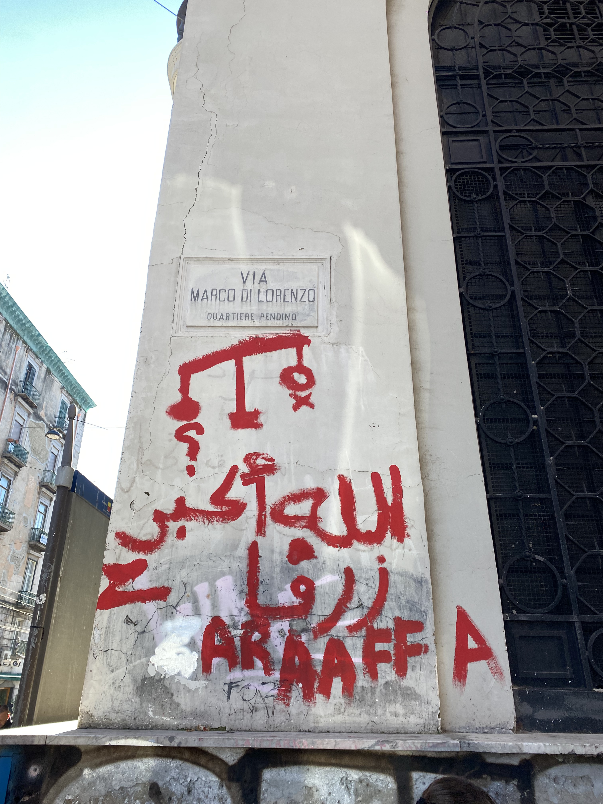
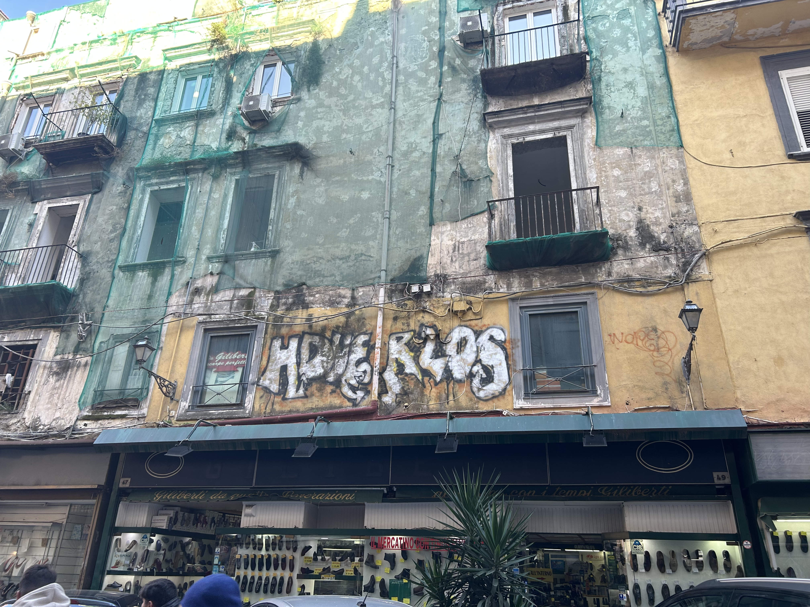

## Graffiti
Il 5 dicembre un gruppo di lavoro si è recato in zona Garibaldi per un giro di perlustrazione, con una lente puntata sui graffiti presenti nelle zone,l'intento era quello di esplorare questa forma di espressione, considerata "atto di vandalismo", ma che in molti casi veicola un messaggio che porta con se differenze culturali, mostrando visioni e sensibilita' diverse all'interno della comunita'.

Durante l’osservazione, abbiamo anche notato che alcune attività commerciali utilizzano i graffiti come mezzo di promozione o comunicazione come ad esempio insegne. Inoltre, in Via Umberto, sugli spartitraffico, sono presenti scritte realizzate con bombolette spray che affrontano il tema del cambiamento, un elemento significativo dato che questa strada è spesso attraversata dai cortei.

Un altro aspetto evidente è la percezione della popolazione locale nei confronti delle attività commerciali: le sale scommesse e i casinò sembrano godere di maggiore considerazione rispetto a farmacie e negozi di beni di prima necessità.

{ width=250 height=200 }
{ width=200 height=200 }
{ width=200 height=200 }
{ width=230 height=200 }
{ width=200 height=200 }
{ width=230 height=200 }
