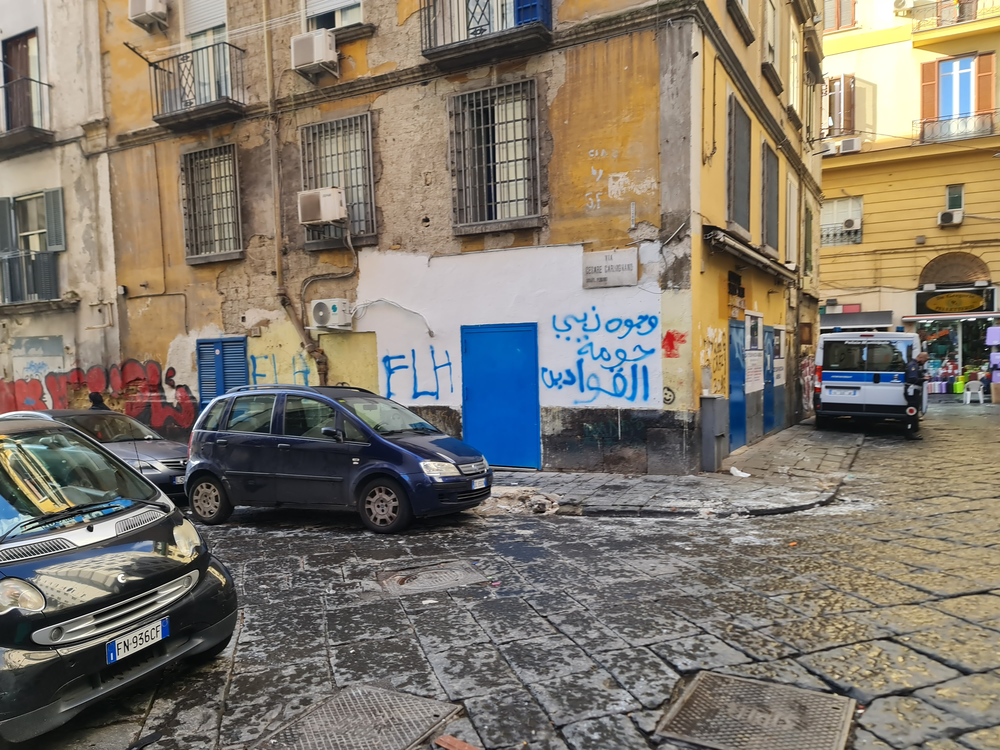
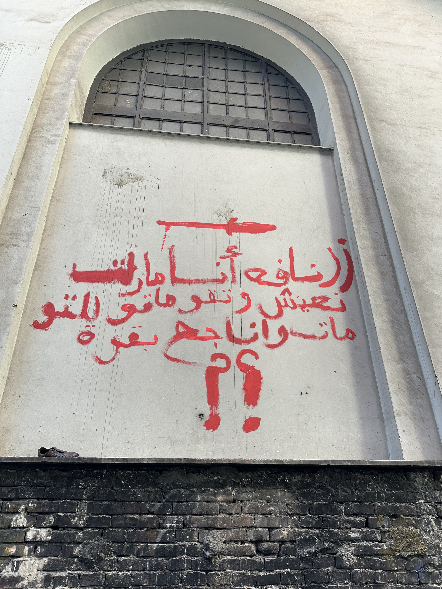
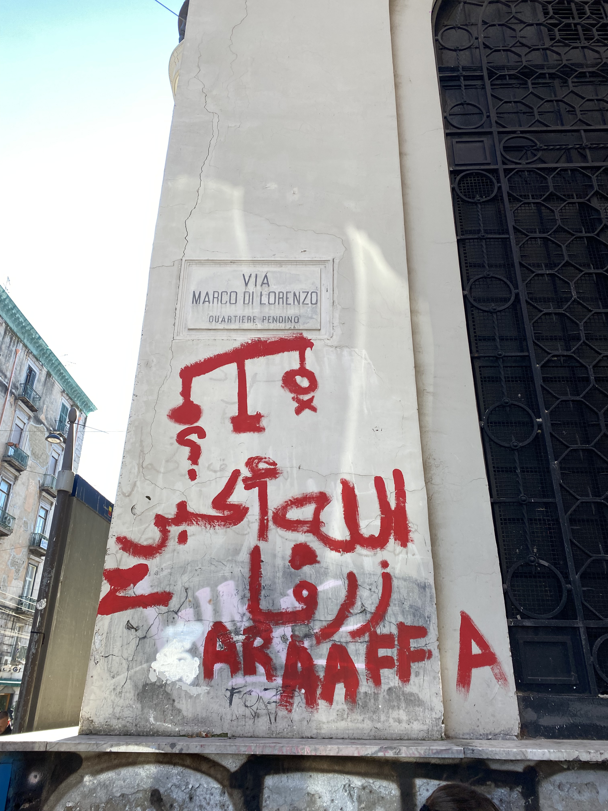
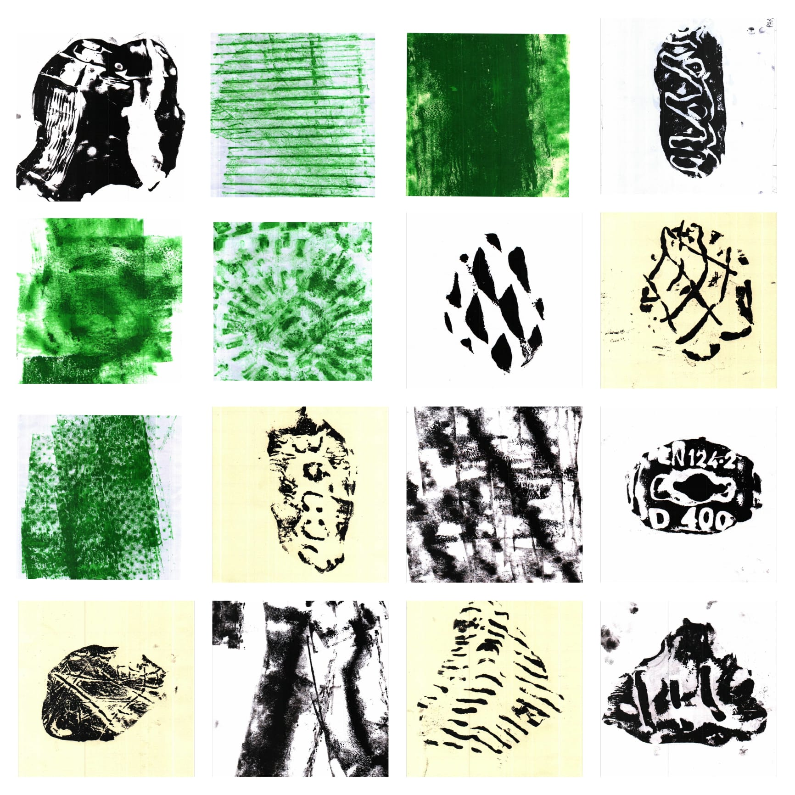
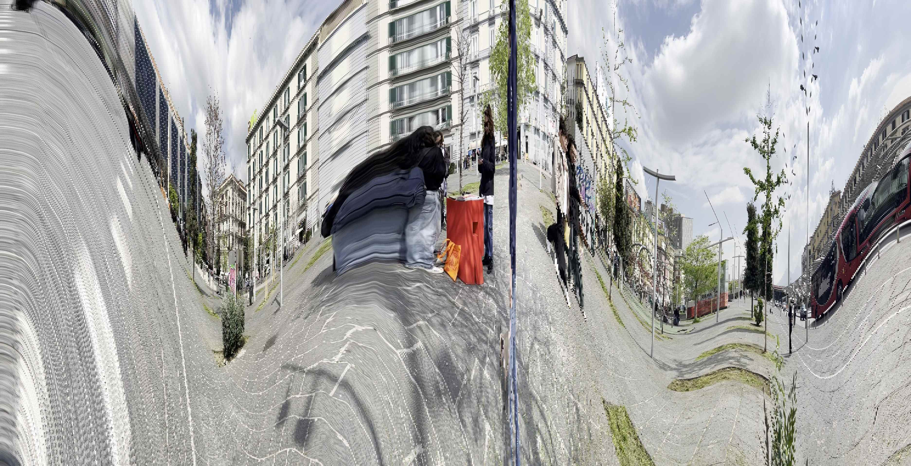

## Graffiti
Il 5 dicembre un gruppo di lavoro si è recato in zona Garibaldi per un giro di perlustrazione, con una lente puntata sui graffiti presenti nelle zone,l'intento era quello di esplorare questa forma di espressione, considerata "atto di vandalismo", ma che in molti casi veicola un messaggio che porta con se differenze culturali, mostrando visioni e sensibilita' diverse all'interno della comunita'.

Durante l’osservazione, abbiamo anche notato che alcune attività commerciali utilizzano i graffiti come mezzo di promozione o comunicazione come ad esempio insegne. Inoltre, in Via Umberto, sugli spartitraffico, sono presenti scritte realizzate con bombolette spray che affrontano il tema del cambiamento, un elemento significativo dato che questa strada è spesso attraversata dai cortei.

Un altro aspetto evidente è la percezione della popolazione locale nei confronti delle attività commerciali: le sale scommesse e i casinò sembrano godere di maggiore considerazione rispetto a farmacie e negozi di beni di prima necessità.

{ width=250 height=200 }
{ width=200 height=200 }
{ width=200 height=200 }
{ width=230 height=200 }
{ width=200 height=200 }
{ width=230 height=200 }

## Frottage
L’idea era quella di realizzare un censimento completo di tutti gli alberi presenti sulla Piazza, che sono però più di cinquanta. A partire da questa scoperta, abbiamo iniziato a sperimentare una tecnica di registrazione visiva piuttosto semplice e immediata: il frottage.

Il procedimento è semplice: si avvolge un telo attorno al tronco dell’albero e, utilizzando un rullo imbevuto di inchiostro a base d’acqua, si passa sulla superficie. In questo modo, l’inchiostro evidenzia solo le parti in rilievo del tronco, restituendo una trama visiva unica e irripetibile.

Con il tempo, però, abbiamo sentito la necessità di trovare un formato più tascabile e immediato. È così che siamo passati all’uso di cartoncini A5. Perché questo cambiamento? Nonostante il frottage su telo fosse efficace per creare relazione con gli abitanti della piazza coinvolgendoli direttamente nel gesto, presentava anche diverse limitazioni tecniche: i tempi di asciugatura, il trasporto dei materiali e, soprattutto, il fatto che l’opera realizzata non poteva essere lasciata a chi vi aveva partecipato.

Con i cartoncini A5, invece, non solo è più semplice restituire subito un segno tangibile a chi prende parte all’azione, ma si aprono anche possibilità più ricche dal punto di vista espressivo. È possibile, ad esempio, selezionare solo una porzione di texture, concentrarsi su dettagli, o sovrapporre più tracce in modo creativo. Inoltre, questo formato ci ha permesso di sperimentare nuove tecniche di frottage, utilizzando materiali diversi come:

Pastelli a cera
Pastelli a olio
Argilla industriale
E soprattutto un’argilla artigianale fatta in casa

La realizzazione di quest’ultima è sorprendentemente semplice: bastano acqua, bicarbonato e amido di mais. Mescolati e scaldati in un pentolino, questi tre ingredienti si trasformano in una pasta densa dalla consistenza perfetta, ideale per creare impronte e texture direttamente sul supporto.

{ width=350 height=350 }

## Panoramica inversa
Ma come si fa? Il funzionamento è molto semplice: all’interno di una cartella vanno inseriti due elementi fondamentali:
il file rinominato panorama.py 
il video da elaborare, chiamato video.mp4 o qualsiasi altra estensione

Una volta avviato lo script con il comando:
python panorama.py

il codice eseguirà l’elaborazione automaticamente e salverà il risultato in una cartella secondaria, generata in automatico all'interno della stessa directory. Non sarà necessario intervenire ulteriormente: il file elaborato sarà pronto all’uso.
{ width=1000 height=1000 }

